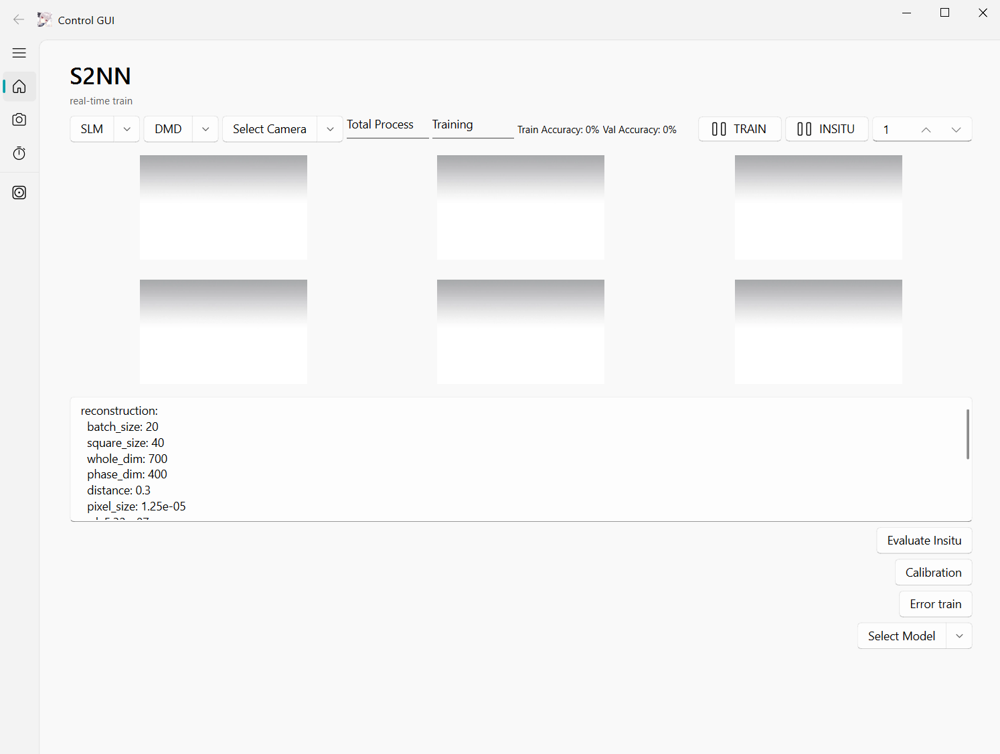

# OSN-SONN

Diffractive optical neural networks (DONNs), despite their theoretical ability to achieve high parallelism and high bandwidth, are significantly limited by the dense and float information generated by frame-based sensors at low operating frequency. To address this issue, we propose innovative optical spiking neurons (OSNs) that mimic biological neuronal behavior to generate sparse and binary information, which enables more efficient information transmission and thus dramatically improves the speed and energy efficiency of optical neural networks. Based on OSNs, we have built a system capable of processing visual information at unprecedented speeds of up to 3,649 frames per second—over 30 times faster than the previous reported results from DONN with similar platform but frame-based processing.

Here, we provide the data and code associated with the paper titled "Optical Spiking Neurons Enable High-Speed and Energy-Efficient Optical Neural Networks."


## Preview
We developed a hardware control software to facilitate the operation of multiple devices. Additionally, by integrating various scripts, we created the code for S2NN, S3NN, and S4NN...


## Notes
### Metavision
Some of the codes use the raw data reader provided by Metavision. Therefore, they require installing the Metavision Essentials package available here: [ https://www.prophesee.ai/metavision-intelligence-essentials-download/ ] We used Metavision Essentials 2.3.0 or 4.3.0. Note that these require specific versions of Python (3.8 or 3.9 for Metavision 4.3.0), and that the codes were tested only with Python 3.9.18. Other versions of Python will likely not work. It is important to follow closely the installation guidelines [ https://docs.prophesee.ai/stable/installation/windows.html ] until the "Installation" section included and to run the executable file with admin rights. 
### ALP
https://github.com/wavefrontshaping/ALP4lib

### Solid-state fibre laser
https://github.com/complight/FisbaReadyBeam   
If you are using Windows, please refer to the modified version of the code provided by us.


### Drivers
Here, we provide the serial numbers of our hardware, including the DMD, SLM, laser, and event sensor, for reference.

Solid-state fibre laser (READYBeam™, FISBA AG) 

DMD (V-9001c VIS, ViALUX GmbH).

Phase SLM (X15223-16, HAMAMATSU) 

Neuromorphic vision sensor (PEK4I36HDCD CS, PROPHESE E S.A.).

To use the code, please contact the manufacturer to provide the necessary drivers and libraries.

## Dependencies
We bulit the code  based on pyqt and PyQt-Fluent-Widgets. Install full-featured version:
```
pip install "PyQt-Fluent-Widgets[full]" -i https://pypi.org/simple/
```

If you are using PySide2, PySide6 or PyQt6, you can download the code in PySide2, PySide6 or PyQt6 branch. 

Other important dependencies are torch-2.1.1+cu118, [lightridge](https://lightridge.github.io/lightridge/tutorials.html)    

## Data Preprocessing
We provide an easy access to the used datasets in the [[google drive]](https://drive.google.com/drive/folders/1c71Ei1OQxy5ee4EXCoVPkqI6_U5q4FNF?usp=sharing)

**Data_preproccess.ipynb**: A Jupyter Notebook containing various data preprocessing steps.
**Weizmann Dataset**: The raw data is stored in `.mat` files as matrices, which need to be converted to `.avi` videos. These videos are then converted into event data using the official SDK for event cameras, and finally, the event data is converted into event frames.
**KTH Dataset**: The raw `.raw` files, captured by the event camera, are directly converted into event frames.
Subsequent processing includes resizing `.png` images and generating `.hdf5` and `.npy` files for training.

1. **Weizmann Dataset Preprocessing**:
   - Convert `.mat` files to `.avi` video format.
   - Use the official event camera SDK to convert the video into event data.
   - Convert the event data into event frames.

2. **KTH Dataset Preprocessing**:
   - Merge all videos into one total video.
   - Convert the combined video to raw event data using an event camera.
   - Convert `.raw` files to event frames.

3. **General Processing**:
   - Resize `.png` images.
   - Save the data as `.hdf5` and `.npy` files for model training.


## Guidelines

### FisbaReadyBeam
This folder contains functions related to laser operations. Depending on the specific ports, you need to adjust the code accordingly. On the first attempt to communicate, the code might display a "communication timeout" message; if this occurs, please try again.

### complexPytorch

Following [[C. Trabelsi et al., International Conference on Learning Representations, (2018)](https://openreview.net/forum?id=H1T2hmZAb)], it allows the following layers and functions to be used with complex values:
* Linear
* Conv2d
* ConvTranspose2d
* MaxPool2d
* AvgPool2d
* Relu
* Sigmoid
* Tanh
* Dropout2d
* BatchNorm1d (Naive and Covariance approach)
* BatchNorm2d (Naive and Covariance approach)
* GRU/BN-GRU Cell
  
### BAT
This folder contains the code implementation for the BAT. 
To start the training process for the BAT, use the command below:
``` 
$ cd BAT
$ python train_donn.py
```
This command will initiate the training script for the BAT using the specified configurations in config.yaml
If you face GPU memory issues during training, reduce batch size or change model size.

### Function Details

`dante.py` Contains basic code for model training and testing. This file provides fundamental operations to initialize, train, and evaluate machine learning models using PyTorch.

`dmd_func.py` Includes functions specific to Digital Micromirror Device (DMD) operations. These functions help in controlling and configuring DMDs.

`event_func.py` Contains functions required for event camera operations. Event cameras capture changes in a scene at a high temporal resolution. This file focuses on event-based vision, processing, and control functionalities.

`has_func.py` Includes functions necessary for controlling a phase spatial light modulator (SLM). This file helps in adjusting and managing the phase modulation parameters for optical beam control.

`net.py` Contains the model code required for BAT (a specific deep learning or image processing model, the exact purpose should be clarified). It defines the architecture, layers, and forward pass of the model.

`optical_network.py` Provides foundational code for the S2NN model, including code for visualizations. This file implements the structure of the neural network and allows for analyzing and visualizing results through graphical representations.

`optical_unit.py` Contains simulation code for various physical layers, such as DMDs and SLMs. It acts as a physical model to emulate how these devices interact with light in the optical setup.

`slm_func.py` Includes control code for a Meadowlark SLM. This file contains functions to interact and configure the SLM to achieve precise light modulation, aiding in advanced optical experiments.

`train_func_reconstruction.py` Combines event camera data for training and inference purposes. This file integrates event-based vision with training and eval routines.

`utils.py` Contains a set of common utility functions used across the project. 

### Interface Components

`camerainterface` Used to control camera operations, such as turning the camera on/off and capturing images. This file manages communication between the software and hardware camera.

`card.py` Contains small widgets for the user interface (UI). These are modular components used to enhance user interaction with the application.

`eventinterface.py` Responsible for controlling the event camera and real-time image transmission. It handles the data flow from the event camera to the visualization component, allowing for live feedback and analysis.

`icon.py` Used for displaying icons in the user interface. This file manages visual cues and icons to make the UI more intuitive.

`image_display.py` Contains code for processing images. It includes functions for image visualization, filtering, and any preprocessing needed for analysis.

`message.py` Handles message passing between different components of the software. This file ensures communication between various modules, managing data exchange and synchronization.

`roundwindows.py` Used for UI window control. This file focuses on handling the layout, design, and behavior of application windows, including rounded corners or specific style elements.

 `s2nninterface.py` Controls training and inference processes for the S2NN model. It provides an interface to manage model operations, input data, and display output results.


### Resource
For UI.

### Scripts
Here's a detailed description of the scripts you've listed, in English, with additional information:

`Calibration.py` This script is responsible for training a phase using neural network to calibrate the system.

`helper.py` This script provides utility functions to assist in controling device and the system flow.

`inferonce.py` This script initiates an inference, serving as a data collection and testing module. 

`runner.py` This script acts as a testing module, using the functions from `helper.py` to evaluate both the system and the neural network model.

`main.py` This script is the main entry point for launching the software's **GUI**. In the GUI, users can interact with the software to perform various tasks, such as:

- **Model Training**: Initiating and managing the training of neural networks with adjustable parameters and monitoring the training progress through visualizations.
- **Device Control**: Managing the hardware connected to the system, allowing users to configure, calibrate, and operate devices directly from the interface.
- **Image Processing**: Providing tools for image analysis and processing, including image enhancements, segmentation, filtering, and visualization.

Afterwards, runs can be started directly from the projects root directory using the command line:

``` 
$ python main.py
```
Click 'reconstruction' and press 'train', you can view the S2NN training process in the GUI.
The config.yml file contains entries for all relevant parameters. You can change it in GUI or in files.

For other  datasets used in our paper,  you can see the data preprocess part.

### S3NN and S4NN Training

This project contains code for training the KTH and Weizmann datasets using the S3NN and S4NN architectures, as well as related data preprocessing and model evaluation processes.

#### File Descriptions

- **KTH_S3NN.py**: Code for training the KTH dataset using the S3NN architecture.
- **Wei_S3NN.py**: Code for training the Weizmann dataset using the S3NN architecture.
- **KTH_S4NN_0.py**: Code for training the KTH dataset using the S4NN architecture. This script will generate seven models, with distinct workflows for the first three classes and the last three classes:
  - For the first three classes: Modify the file paths in the configuration file four times, run the script four times to generate four models (including a model to distinguish between the first three and the last three classes).
  - For the last three classes: First, modify the `forward` function in the `donn` model, then change the file paths in the configuration file three times, run the script three times to generate three models.
- **KTH_S4NN_1.py**: Loads the seven pre-trained models to obtain predictions from each model. During use, switch `path_1~4`, and the results will be saved in `.npy` files.
- **KTH_S4NN_2.py**: Computes the final accuracy based on the `.npy` files generated by `KTH_S4NN_1.py`.
- **Calculating Video Accuracy**: When calculating video accuracy, all scripts load an `.npy` lookup table. This file contains details about which video each event frame belongs to, along with specific information about the person in the video, allowing for accurate aggregation of prediction results.


